# Online Quiz Portal with Random Question Paper Generation and Load Balancer

## Introduction
Genesis (Random Quiz Generator) can be used in schools, institutions, colleges, and by other test paper setters who want to have a huge database of questions for frequent generation of question. You can create random question paper for each student with this software anytime within seconds. One can make many sets of paper from one database.
### Six types of questions are provided:
1. Multiple Choice Type
1. Numerical Type
1. Dropdown Type
1. Fill in the blanks Type
1. Short answer Type
1. Essay Type

Question paper is generated **dynamically and randomly** when a student clicks on the button to attempt a quiz. Full customization of quiz configuration is provided to the instructor. Number of questions of each type, total number of questions, marks for each type of question and maximum marks along with the duration of the quiz can all be set by the instructor. It is a **distributed application** for distributed online quiz. The project also includes organization of question bank, and making system highly available. **High Availability** is provided using replicated servers and static load balancing technique improves the throughput of the whole system.

## Features
1. Random quiz generation
1. Session Maintenance
1. Quiz configuration
1. Quiz Response Store
1. Distributed database
1. More than one server to handle request
1. Load balancing
1. Question paper Requests using RPC
1. Fault tolerance

### Technology Used
* HTML
* CSS
* Javascript
* MySQL
* PHP
* PHPMyAdmin
* Template For Website : Material Design Template
    * https://www.creative-tim.com/product/material-kit

### **Database Information**
|Table Name|Purpose|
|---|---|
|studentinfo| Store information about the registered students|
|instrutorinfo| Store information about the Teacher and TAs|
|quizrecord| Store information about latest quiz given by students|
|response| Stores answers of the questions submitted by students|
|result| Stores information about marks of students|
|quizconfig| Stores configuration about quiz|
|mcqdb| Stores questions which have 4 choices|
|numericaldb| Stores numerical type questions|
|dropdown| Stores question which have multiple choices|
|fillintheblanks| Stores fill in the blanks type question|
|shortanswer| Stores short answer type question|
|essay| Stores essay type answer|

### **Source Code Information** (Single Server)      
|File Name|Purpose|
|---|---|
|**database.php**|Stores Database Cofiguration|           
|**instructorlogin.php**|Login Page for Instructor|    
|**instructorhome.php**|Home Page for Instructor|     
|**questionfeed.php**|Question Feeding into Question Bank|      
|**quizconfig.php**|Quiz Configuration Page|        
|**instructorlogout.php**|Logout for Instructor|   
|**studentregister.php**|Register Page for Students|
|**studentlogin.php**|Login Page for Students|
|**studenthome.php**|Home Page for Students|
|**quizhome.php**|Quiz Home Page|          
|**randomqgen.php**|Random Question Papers Generation Function|        
|**quizpage.php**|Live Quiz Page|          
|**jump.php**|Jump to Question Number Function|               
|**submit.php**|Submit Function for Quiz|
|**studentlogout.php**|Logout for Students|
### **Source Code Information** (Multiple Server)  
|File Name|Purpose|
|---|---|           
|**servers.php**|Stores IP of servers|
|**questiondatabase.php**|Stores IP of question bank servers|  
|**multiquestionfeed.php**|Simultaneous question feed into all servers|  
|**redirect.php**|Redirect Page on Load Balancer|         
|**randomredirect.php**|Random Redirect Page on Load Balancer|    
|**weightedredirect.php**|Weighted Redirect Page on Load Balancer|
|**weightedservers.php**|Stores weighted server ip address|
---
### Architecture Model
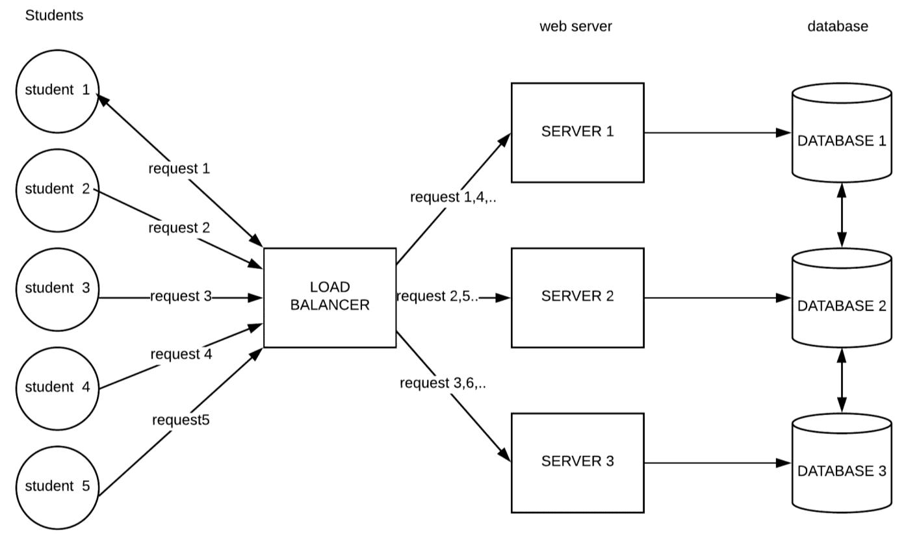

### Use Case Model
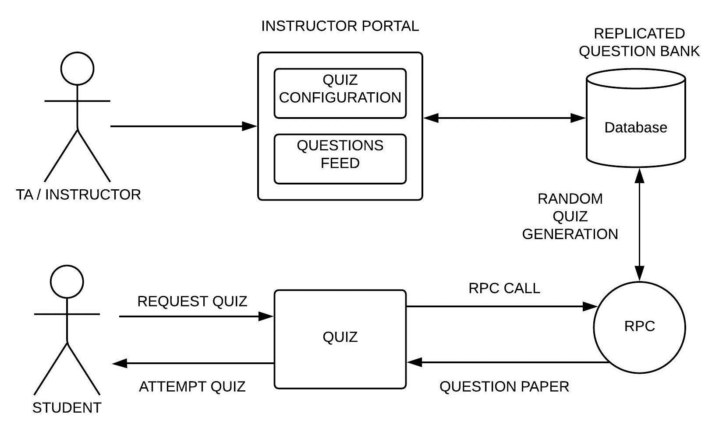
---

## Run Project
* Clone Repository 
```
git clone https://github.com/ft-abhishekgupta/php-mysql-onlinequizportal
```
* Install Dependencies :
    * Apache Server
    * MySQL
    * PHP

* Copy files in code to Apache Directory : ```var/www/html/```

* Open PHPMyAdmin
    1. Create Database **quiz**
    1. Import ```quiz.sql``` in the database

* Modify ```database.php``` file with MySQL Credentials
* Open Browser :
    * Open **localhost/instructorlogin.php** : For Admin Panel
        * Username : instructor@gmail.com
        * Password : password
    * Open **localhost/studentlogin.php** : For Students Panel
        * Username : 123
        * Password : 123
---
## Use Project
You can use this project directly to conduct a quiz.
Just Follow these steps :
1. Run the project
1. Use PHPMyAdmin to clear the tables in database
1. Create new instructor in database.
1. Use **instructorlogin** page to insert questions and quiz configuration
1. Give **(Server IP Address)/studentregister.php** link to students.
1. The quiz runs on lan without any modification.
---
## Set Up Load Balancer
This step is only for setting up multiple servers for the quiz.
* Replicate Server Setup in multiple systems 
* Add Each Server Ip Addresses to ```servers.php```
* Select one server as the Load Balancer.
* Enable remote mysql access for each server.
* Open PHPMyAdmin in Load Balancers
    1. Create Database **load**
    1. Import ```load.sql``` in the database
* Give **(Load Balancer IP Address)/redirect.php** link to students.

Multi Server Question Feed also works in this configuration, where instructor can feed questions into multiple servers simultaneously.

### Other Load Balancer Implementation
* **Random** : use ```randomredirect.php```

* **Weighted** : use ```weightedredirect.php``` (also modify *weightedservers.php* file)
----
## Screenshots

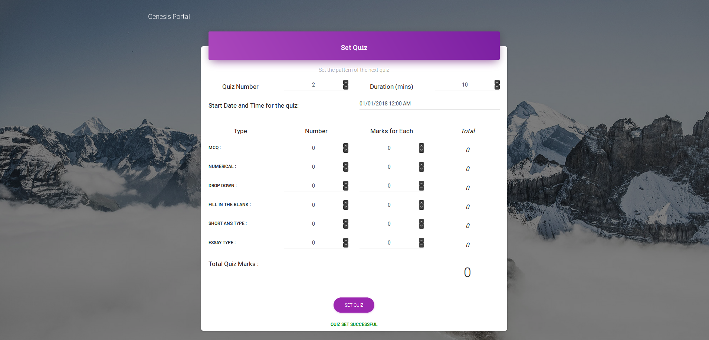
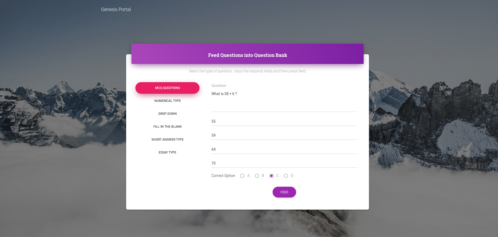
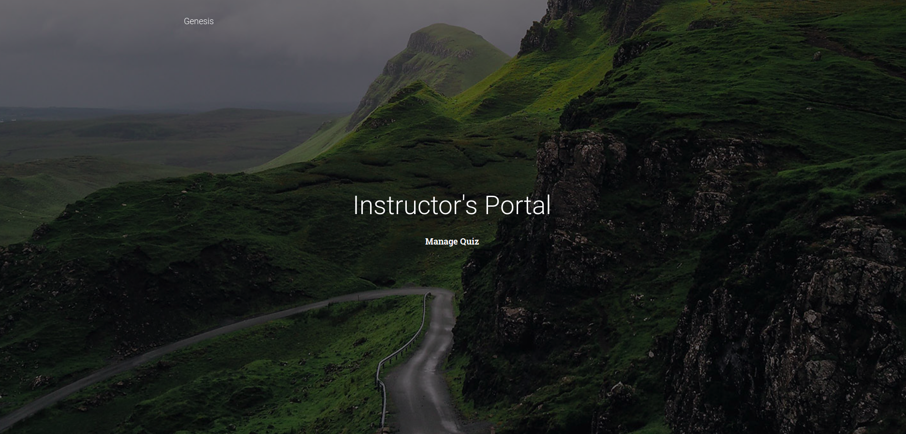
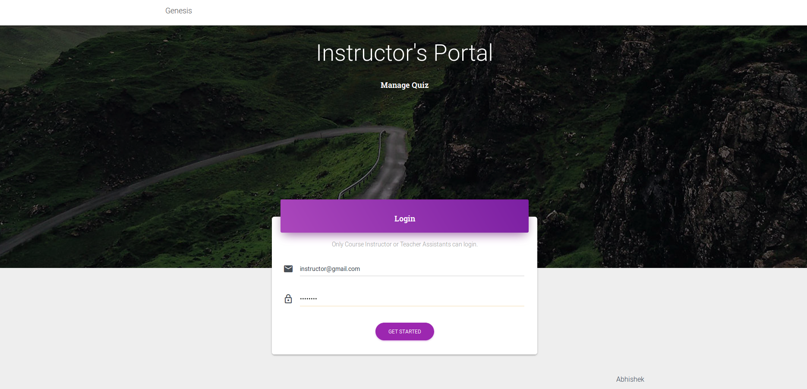

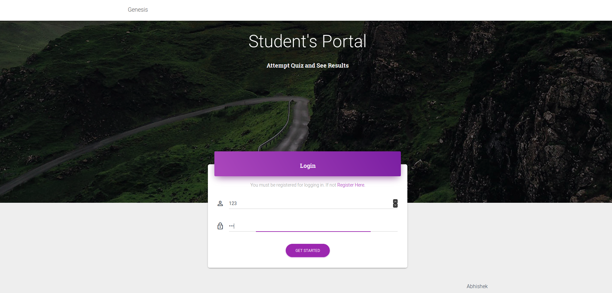


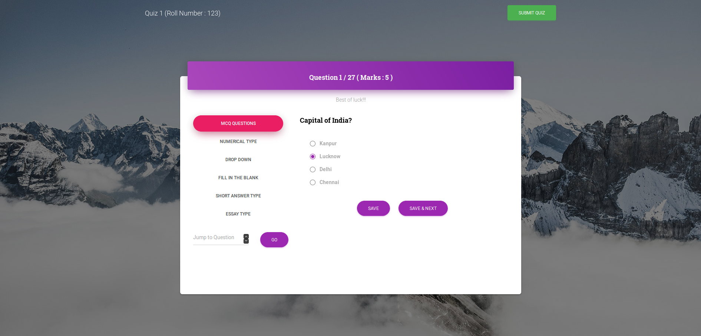
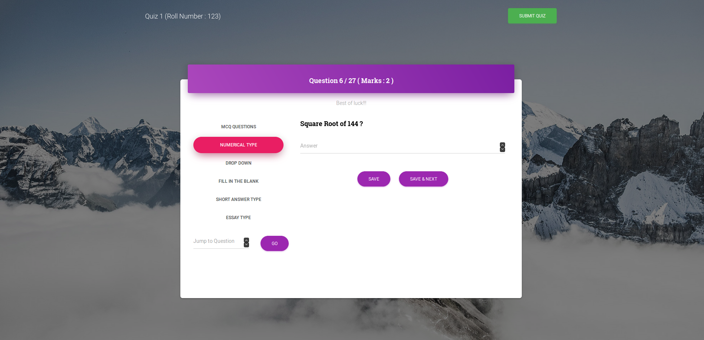
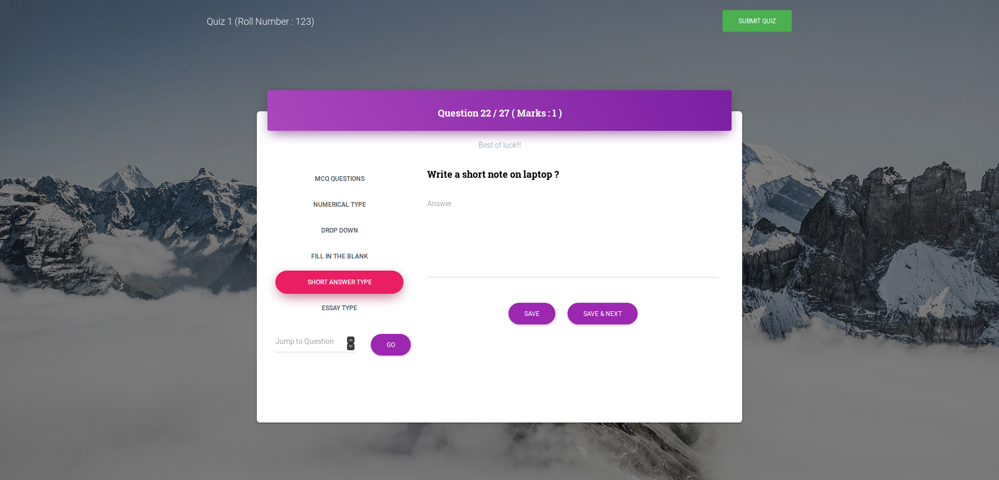
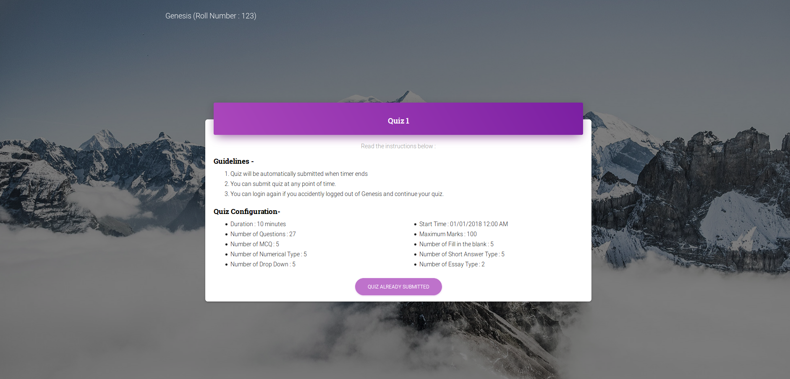
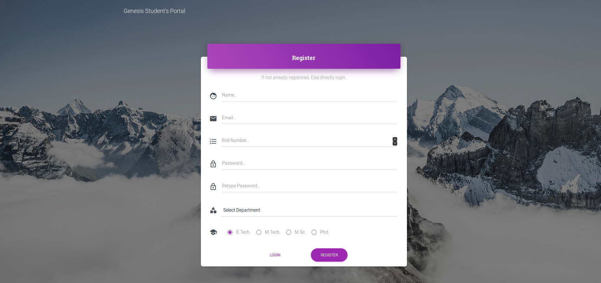
---

    